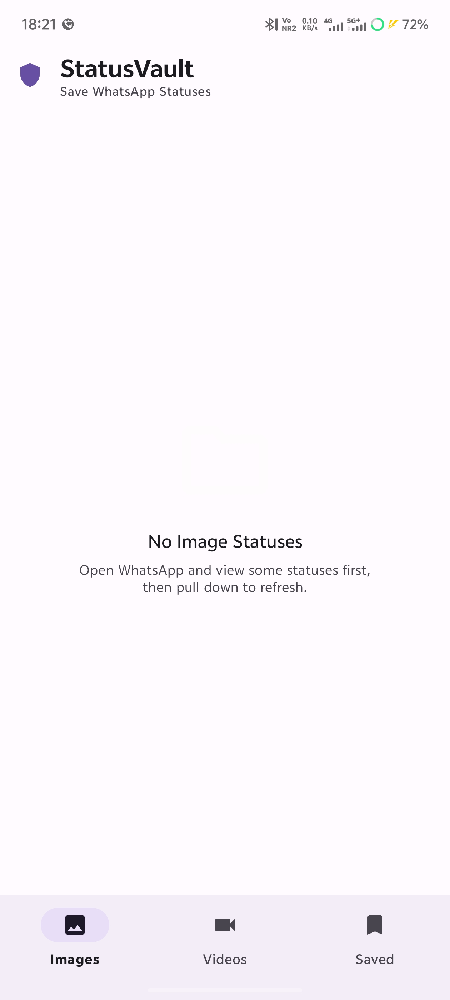
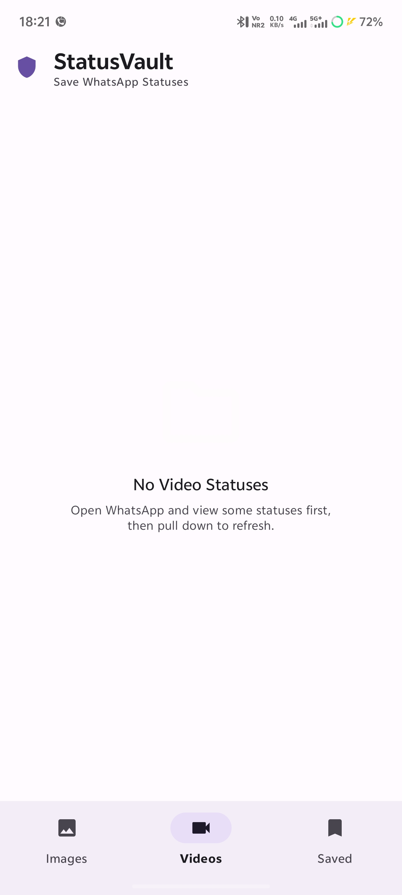
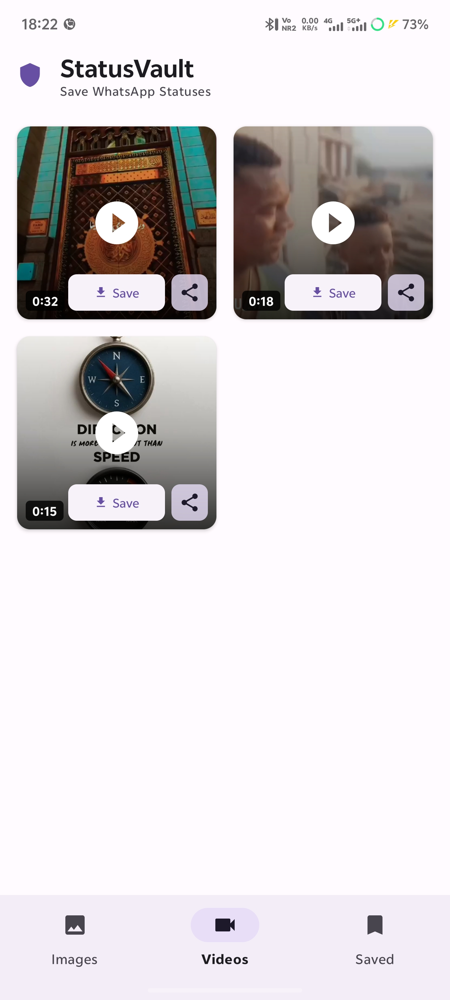
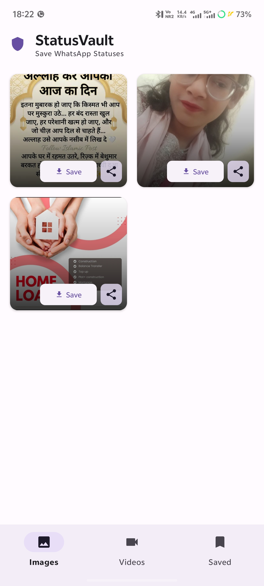
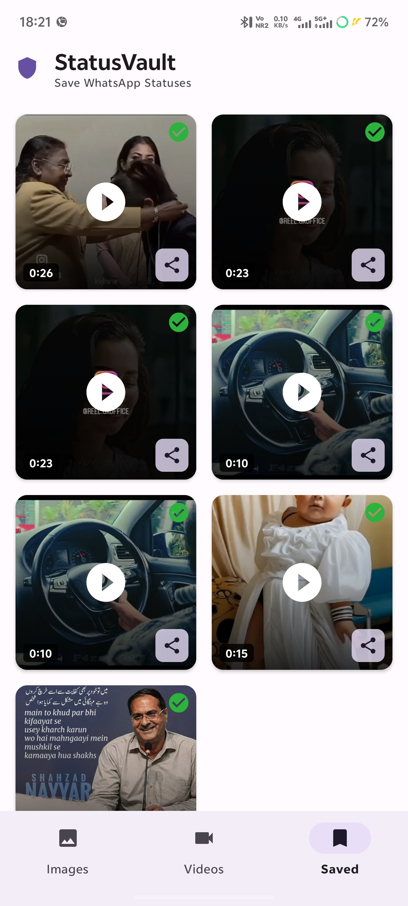

# 🚀 StatusVault — Modern WhatsApp Status Saver (Android/Kotlin)

A production-ready Android app built using clean architecture and modern storage APIs.

---

## ✨ Highlights
- MVVM + Repository architecture
- MediaStore API (Scoped Storage compliant)
- Supports Android 7 → Android 15
- Clean Material UI (Light/Dark)
- Fast media scanning & saving
- No unnecessary permissions

---

## 🧠 Architecture
- ViewModel + LiveData
- Repository Pattern
- Modular code structure

---

## 📸 Screenshots

---

## ⚙️ Tech Stack
- Kotlin
- Android SDK
- MediaStore API
- RecyclerView

---

## 📚 For Developers
This project serves as a reference for:
- Scoped Storage (MediaStore)
- MVVM architecture in real-world apps
- File handling in Android 10+

---

## 🔥 Why this project matters
Unlike typical status saver apps, this project focuses on:
- Clean architecture implementation
- Modern Android storage handling
- Real-world utility use case

---

## 👨‍💻 Maintainer
syedmoinengineer
